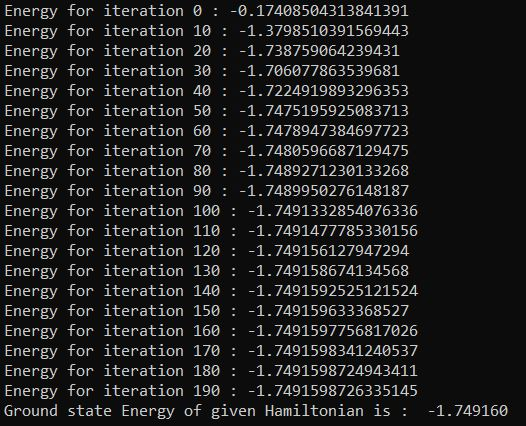

# Calculating the Ground State Energy of Hamiltonian using VQE with custom Ansatz

The evolution of quantum systems is governed by a special type of matrix operator called a Hamiltonian, usually denoted H. The energies of a system, and the states that have them, can be obtained by finding the eigenvalues (or eigenenergies), and eigenvectors (eigenstates) of H:

H|ψi> = Ei|ψi>

where the {|ψi>} are the eigenstates, and {Ei} are the real-valued eigenenergies. Of particular interest is usually the ground-state energy:

H|ψg> = Eg|ψg>, Eg = min{Ei}

One algorithm for finding this energy using a quantum computer is the variational quantum eigensolver (VQE). The VQE works by parameterizing the space of possible quantum states, and optimizing to find the set of parameters that yield the lowest energy.

The VQE consists of both quantum (Q) and classical (C) computations:
1. (C) Choose a suitable ansatz circuit U(α)
2. (C) Choose a starting set of parameters α
3. (Q) Apply U(α) and measure the output state
4. (C) Use measurement results to compute numerical value of <0|U†(α)HU(α)|0> (the energy)
5. (C) Use some optimization routine to choose a new α that should bring us to a state closer to the ground state.
6. Repeat steps 3-5 until the optimizer converges to a minimum value, or the number of iterations has exceeded a specified maximum.

The portion that is done on the quantum computer involves simulation of the quantum system—this is what quantum computers do best, and what gives VQE an edge over just solving this problem classically. 

##### Input:

Hamiltonian of which the ground state energy is to be found out is given to the algorithm is shown in input file.

### Result

##### Output of the given Halmitonian is shown below,

It can be seen that after 200 iterations the algorithm gives accurate Ground-state value of the hamiltonian.
